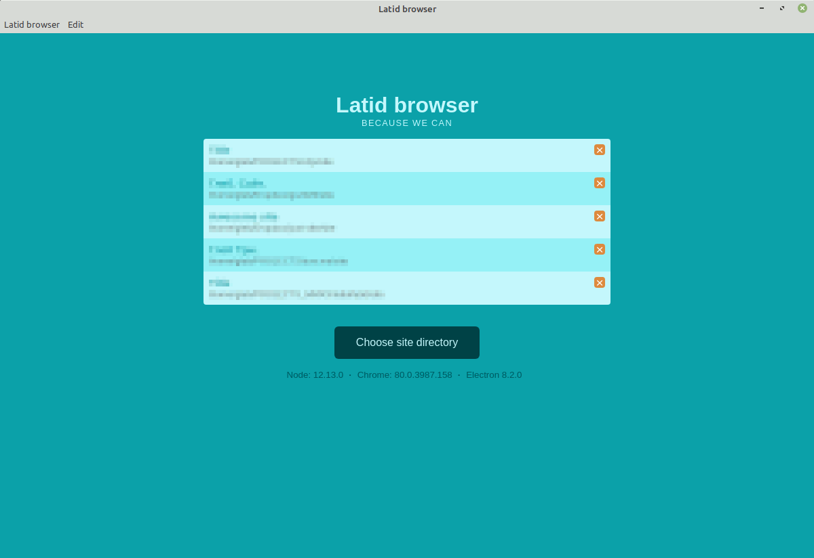

# Latid-browser 

Electron app to preview and edit sites, made with [Latid static site generator](https://github.com/girobusan/latid). 
Now at early stages of development, but usable. Works on Linux, Mac and Windows.

Install
-------
Download release for your platform, use regular install procedure.

| Linux                | Mac                                                 | Win                          |
| -------              | ------                                              | ----------                   |
| Install .deb package | Mount .dmg, drop Latid to  your Applications folder | Unpack and launch setup file |

 

Usage
-----
To load site for the first time,
click the `Choose site directory` button on main screen, and choose the directory,
where all site files resides (*not* `src` directory, but the directory, in which
`src` directory is). You'll be presented with regular Latid interface.

Your site will be added to list on the main page.

Publish command
---------------
You can run publish command (defined in `settings.toml` file) from latid-browser.
Choose `Edit -> Run publish command` menu or just Ctrl + P (Command + P on Mac).

Known problems
--------------
Most errors reported to App developer tools (Open through the Latid browser menu
or via Ctrl + D). GUI needs improvement.

